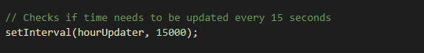

# Work-Day-Scheduler

Link: https://fatmoogle.github.io/Work-Day-Scheduler/

Daily planner that saves user input and adjusts according to time of day.

This homework was a bit simpler than most of the other assignments we have had. We were tasked with completing the starter code in order to create a day planner that was dynamic and updated with the time. Luckily, this part of the assignment was completed, and we just had to update the code to get it to save correctly and display properly. 

First off, we needed to set the local storage and save what would be called later on in the time blocks of the web page. This is basically the hour and value within the time block that the user inputs. 

We would also have to call upon what was stored in local storage later on, so we needed to use the "get.item" command, and then store that in a variable which I labled as userInput, because it is whatever was input by the user and stored in local storage. 

I then added colors to the blocks of time to signify what was present, past, or future. This was done by calling the element on the html page and adding classes according to what time it was. This was done in the CSS, but I added my own colors via JS by adding in the CSS property. "This" here is reffered to as the object calling the function, which is the ".time-block" class.

After this, we set up an interval to update the webpage every 15 seconds so that it would update the html time blocks to be in the correct time, whether it is present, past, or future. 

